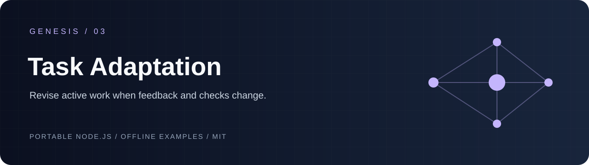
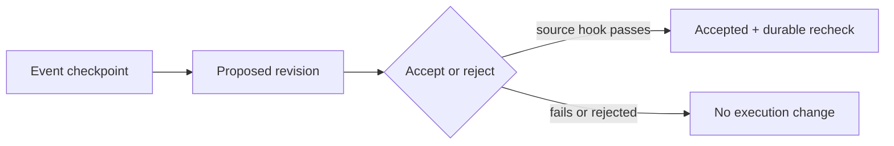

# genesis-task-adaptation

 

`genesis-task-adaptation` records bounded evidence checkpoints and makes adaptation explicit: acceptance or rejection is durable, source-backed changes require a caller-provided revalidation hook, and accepted changes leave persistent recheck requirements until newer evidence clears them.



## Run locally

```sh
git clone https://github.com/Wassimyounes01/genesis-task-adaptation.git
cd genesis-task-adaptation
npm test
npm run demo
```

No dependency installation is required. The complete runnable setup is in [examples/demo.cjs](examples/demo.cjs); API snippets illustrate integration shapes.


Use it for failed worker checks, user feedback checkpoints, or new evidence that changes remaining work in a bounded plan.

## API and five-minute offline start

```js
const { createAdaptationStore } = require('./index.cjs');
const store = createAdaptationStore({ stateDir: './state' });
store.registerPlan({ planId: 'plan-1', planHash: 'immutable-plan-digest', taskIds: ['task-1'] });
const { revision } = store.checkpoint({
  planId: 'plan-1', eventId: 'failure-1', kind: 'check-failure', summary: 'The check failed.', taskId: 'task-1',
  changes: [{ taskId: 'task-1', action: 'rerun', requireRecheck: true }], sourceRefs: [{ id: 'source-1', version: 'current' }]
});
store.resolve(revision.revisionId, { decision: 'accept', actor: 'reviewer', reason: 'source is current', revalidateSource: source => source.version === 'current' });
store.markRechecked('plan-1', 'task-1', { evidenceSequence: 3, revisionId: revision.revisionId, evidence: { receipt: 'fresh-check' }, validateEvidence: evidence => evidence.receipt === 'fresh-check' });
```

Run `npm test` and `npm run demo` without installing dependencies.

The exact export and input schema is in [module-manifest.json](module-manifest.json).

## Invariants and limitations

Plan bindings and event IDs are immutable. A source-backed acceptance cannot proceed without a revalidation function that returns `true` or `{valid:true}` for every source reference. Rejected revisions never create execution changes. Accepted `requireRecheck` changes remain in persistent state after resolution and only clear for a supplied evidence sequence newer than the decision whose receipt is validated by a caller hook and bound to the accepted revision. This package does not run tasks or know whether a hook’s external source check is honest; callback identity and model identity are not cryptographically authenticated. State is local and synchronous.

See [genesis-task-ledger](https://github.com/Wassimyounes01/genesis-task-ledger), [genesis-plan-graph](https://github.com/Wassimyounes01/genesis-plan-graph), [genesis-context-graph](https://github.com/Wassimyounes01/genesis-context-graph), and [Genesis Suite](https://github.com/Wassimyounes01/genesis-suite) (the coordinator fills final public owner links).
