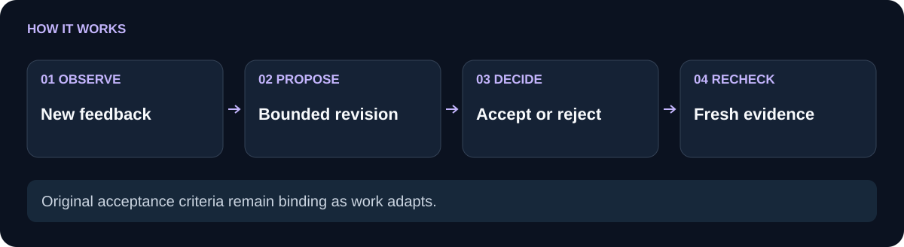

# genesis-task-adaptation

 

`genesis-task-adaptation` records bounded evidence checkpoints and makes a plan change explicit. A checkpoint is tied to a registered plan hash, a proposed revision can be accepted or rejected with an actor and reason, source-backed acceptance requires a caller-provided revalidation hook, and accepted changes that request a recheck remain pending until newer evidence clears them.

**Plan-bound revisions.** **Durable recheck requirements.** **Explicit evidence gates.**

[Use cases](#use-cases) · [How it works](#how-it-works) · [Quickstart](#quickstart) · [API](#api) · [Comparison](#comparison) · [Limitations](#limitations) · [Related components](#related-components)

## Use cases

Use the store when a failed check, user feedback event, or newly changed source should alter remaining work while keeping the reason and plan binding visible. For example, record “rerun task-1 after the check failed,” accept it only after source references are revalidated, and require a later evidence sequence before marking the task rechecked.

In a fictional review, a source update invalidates a previously accepted copy change, but the team’s chat message does not identify which task must be rerun. With the store, the accepted revision remains bound to the plan hash and leaves a durable recheck requirement until newer evidence is validated.

Use simpler code when feedback only changes an in-memory variable and no later reviewer or process needs a durable decision and evidence sequence.

## How it works

<picture>
  <source media="(max-width: 600px)" srcset="docs/flow-compact.svg">
  
</picture>

Call `registerPlan({ planId, planHash, taskIds })` before recording events. `checkpoint` accepts a bounded event kind and summary plus optional task, changes, and source references. Repeated `planId + eventId` input returns the stored revision as a duplicate; a changed plan hash or task list is rejected.

A revision with changes starts as `proposed`. `resolve(revisionId, { decision: 'accept'|'reject', actor, reason, revalidateSource })` persists the decision. Accepting a source-backed revision requires the hook to return `true` or `{ valid: true }` for every source reference. An accepted change with `requireRecheck: true` creates a durable requirement. `isRecheckRequired` reports whether supplied evidence is newer than the decision, and `markRechecked` requires a newer integer sequence, the current revision ID, a receipt, and a caller validation hook before clearing it.

The flow image shows the state transition: observation becomes a proposed revision, a decision is recorded, and only a later bound evidence receipt clears the recheck. State is persisted in `adaptations.json` with bounded payloads and atomic replacement.

## Quickstart

```sh
git clone https://github.com/Wassimyounes01/genesis-task-adaptation.git
cd genesis-task-adaptation
npm test
npm run demo
```

Node.js 20 or newer is required. The package has no runtime dependencies, so no `npm install` is needed. The demo registers a plan, records and accepts a failed-check revision, shows that a recheck is required, and clears it with fresh evidence.

## API

```js
const { createAdaptationStore } = require('./index.cjs');

const store = createAdaptationStore({ stateDir: './state' });
store.registerPlan({ planId: 'plan-1', planHash: 'immutable-plan-digest', taskIds: ['task-1'] });

const { revision } = store.checkpoint({
  planId: 'plan-1',
  eventId: 'failure-1',
  kind: 'check-failure',
  summary: 'The acceptance check failed.',
  taskId: 'task-1',
  changes: [{ taskId: 'task-1', action: 'rerun-check', requireRecheck: true }],
  sourceRefs: [{ id: 'source-1', version: 'current' }],
});

store.resolve(revision.revisionId, {
  decision: 'accept',
  actor: 'reviewer-1',
  reason: 'Source is current; rerun is required.',
  revalidateSource: source => source.version === 'current',
});

store.markRechecked('plan-1', 'task-1', {
  evidenceSequence: 3,
  revisionId: revision.revisionId,
  evidence: { receipt: 'fresh-check' },
  validateEvidence: evidence => evidence.receipt === 'fresh-check',
});
```

The public exports are `AdaptationStore`, `createAdaptationStore`, and `digest`. The complete event, resolution, and recheck schemas are in [module-manifest.json](module-manifest.json); [examples/demo.cjs](examples/demo.cjs) is the runnable offline path.

## Comparison

| Adaptation need | Mutating a task list or leaving a comment | `genesis-task-adaptation` |
| --- | --- | --- |
| Bind a change to the plan it revises | Original version may be unclear | Every revision stores and checks the registered `planHash` |
| Record why work changed | Reason can be separated from the action | Checkpoint, decision, actor, reason, and sequence are persisted together |
| Prevent an unverified accepted change from disappearing | Follow-up may be easy to miss | `requireRecheck` creates a durable per-task requirement |
| Prove the recheck is newer and relevant | “Reran” may be a free-form claim | Sequence must exceed the decision, receipt must bind the revision, and hook must validate it |
| Handle repeated event delivery | Duplicate events can create duplicate revisions | Same tuple returns the original revision with `duplicate: true` |

## Limitations

Source revalidation and evidence validation are caller callbacks. The store records whether those callbacks returned an accepted shape; it cannot prove that a callback fetched the right source, that a person or model is who it claims to be, or that an executor performed the requested action. State is local and synchronous; use an external lock for multi-process writers. It does not run tasks, modify a plan graph, fetch external references, or provide distributed coordination. Defaults bound the store to 100 plans and 200 events, with per-checkpoint limits on changes and source references.

The tests cover source-backed acceptance, stale-source rejection, immutable plan binding, duplicate events, tuple-scoped IDs, bounded payload rejection, and rollback after persistence failure. Run `npm test` to exercise the contract.

## Related components

- [genesis-plan-graph](https://github.com/Wassimyounes01/genesis-plan-graph) validates the dependency and ownership plan before execution.
- [genesis-task-ledger](https://github.com/Wassimyounes01/genesis-task-ledger) records checked artifacts and independent review.
- [genesis-context-graph](https://github.com/Wassimyounes01/genesis-context-graph) supplies source-backed context candidates and approval evidence.
- [genesis-worker-router](https://github.com/Wassimyounes01/genesis-worker-router) handles bounded provider invocation.
- [genesis-suite](https://github.com/Wassimyounes01/genesis-suite) integrates the public modules.
